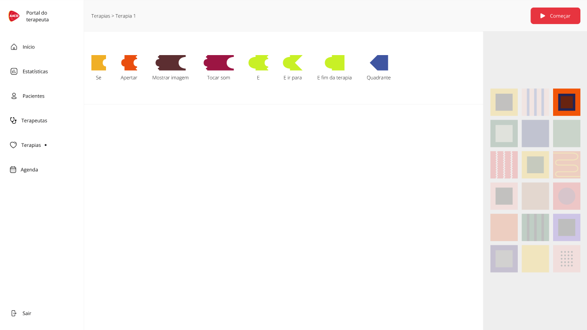
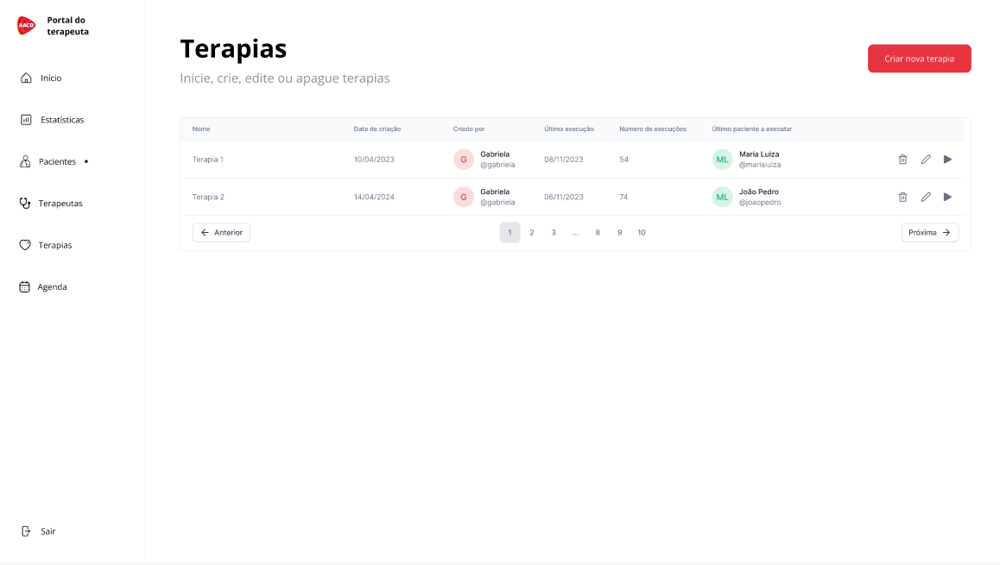
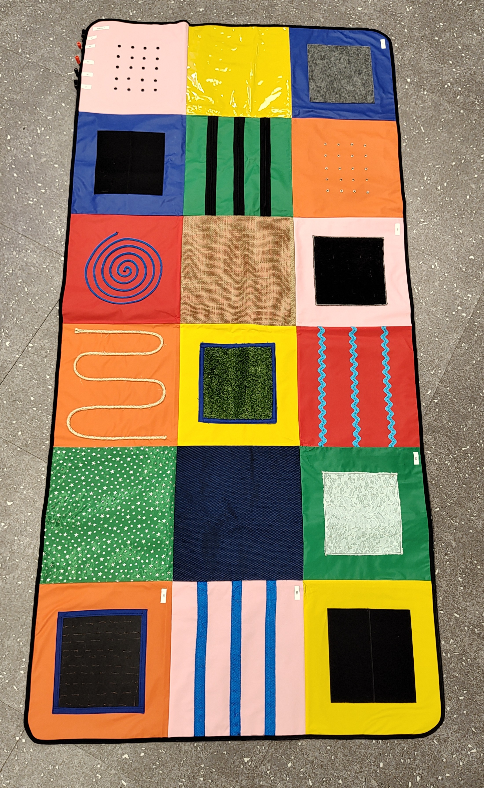
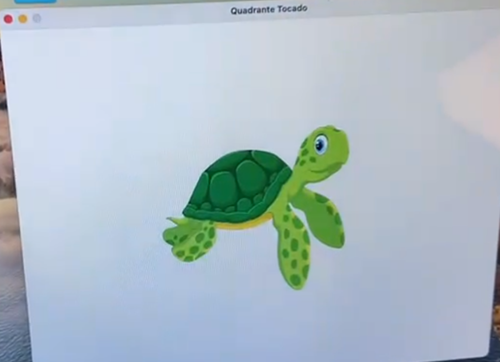

# Artigo

## Introdução

As desordens neurológicas, particularmente a paralisia cerebral, representam um desafio complexo e multifacetado no campo da saúde e reabilitação. Estas condições, que afetam indivíduos em todo o mundo, não apenas impõem limitações físicas, mas também desafiam as capacidades cognitivas e sensoriais dos afetados. A paralisia cerebral, como a desordem neurológica mais prevalente na infância, exemplifica a necessidade de uma abordagem terapêutica abrangente que atenda a uma gama diversificada de necessidades (Assis-Madeira & de Carvalho, S. G., 2018).

A vida cotidiana dos indivíduos com desordens neurológicas é muitas vezes marcada por desafios que transcendem a mera mobilidade. Estes indivíduos enfrentam dificuldades em realizar atividades diárias básicas, além de enfrentarem barreiras significativas na educação, emprego e interações sociais (Bax et al., 2005). Além disso, as famílias e cuidadores desses indivíduos frequentemente se encontram em situações de estresse e exaustão, tendo que adaptar suas vidas para fornecer cuidados contínuos (Olsson & Hwang, 2006).

A Tecnologia Assistiva (TA) tem sido uma área de inovação contínua, oferecendo soluções que vão desde dispositivos de mobilidade até softwares de comunicação avançados (Cook & Polgar, 2015; Scherer, 2012). No entanto, a integração de aspectos motores, cognitivos e sensoriais em dispositivos de TA ainda é um campo em desenvolvimento. A necessidade de soluções mais holísticas e integradas é evidente, especialmente para aqueles que enfrentam desafios complexos em múltiplas dimensões de suas vidas.

Além disso, a reabilitação cognitiva tem se mostrado um componente crucial no tratamento de desordens neurológicas. Há a necessidade de soluções inovadoras que abordem tanto aspectos cognitivos, quanto motores. Paralelamente, a Classificação Internacional de Funcionalidade, Incapacidade e Saúde (CIF), discutida por Vargus-Adams & Majnemer (2014), oferece um quadro abrangente para entender as complexidades da reabilitação e dos cuidados de saúde, enfatizando a importância de uma abordagem holística para contemplar indivíduos com os mais diversos perfis. Esses estudos reforçam a relevância do projeto tapete sensorial, abordado no presente artigo, que se alinha a essas perspectivas ao oferecer uma solução integrada para desafios motores e cognitivos.

Tendo em vista as perspectivas apresentadas, o intuito deste artigo é demonstrar como o projeto "Tapete Sensorial" representa um avanço significativo na direção de tratamentos personalizáveis. Este dispositivo inovador, conectado via Greg Maker, oferece uma abordagem integrada, abordando tanto as necessidades motoras, quanto cognitivas dos pacientes. De forma mais aprofundada, a empresa que se valerá da solução de tapete sensorial desenvolvida neste artigo, AACD, poderá verificar a eficácia dessa nova forma de tratamento de pacientes com leves desordens neurológicas, pois ao fornecer estímulos táteis e proprioceptivos, juntamente com experiências sensoriais e cognitivas enriquecedoras, o tapete promete melhorar a funcionalidade física e enriquecer a experiência de vida dos usuários (Wang & Reid, 2011), possivelmente viabilizando tarefas do dia a dia para esses pacientes. Esse projeto em debate não apenas representa um avanço tecnológico, mas também reflete uma mudança paradigmática na forma como a reabilitação neurológica é abordada.
 
## Trabalhos Relacionados

A pesquisa de Varela & Oliver (2013) destaca a influência das relações familiares, sociais e do acesso a bens e serviços no uso de recursos tecnológicos em diversos ambientes, tomando como foco crianças das mais diversas idades e diagnósticos, juntamente com seus responsáveis, reforçando como a tecnologia assistiva é um meio de facilitar a vida dessas crianças. O presente projeto, focado no desenvolvimento de um tapete sensorial personalizado para terapia ocupacional na AACD, expande essas descobertas, proporcionando uma plataforma para terapeutas personalizarem interações sensoriais adaptadas a crianças com leves desordens neurológicas. Ambos os trabalhos convergem na compreensão da relevância da tecnologia assistiva na vida cotidiana dessas crianças, enfatizando abordagens personalizadas e adaptáveis para integrar naturalmente esses recursos às atividades diárias. Reconhecendo o pragmatismo e a espontaneidade típicos da vida cotidiana, o tapete sensorial busca contribuir para a prática terapêutica ao oferecer uma ferramenta flexível e eficaz que se alinha à evolução constante das abordagens assistivas, atendendo às necessidades individuais das crianças com desordens neurológicas. Entretanto, como conclui a pesquisa de Varela & Oliver (2013), somente a tecnologia assistiva não é suficiente para mudar a vida das crianças. Da mesma forma com o tapete, a interação e integração das famílias no processo de tratamento é fundamental para haver um progresso significativo para a criança.

Petry et al. (2018) apresenta uma abordagem inovadora no âmbito da tecnologia assistiva, concentrando-se na criação de um tapete sensorial personalizado para crianças autistas de 0 a 4 anos. O projeto integra a metodologia de Bruno Munari, que tem como principais conceitos a compreensão profunda do problema, a geração de alternativas com ferramentas de criatividade e por fim o refinamento das mesmas. Junto com os princípios pedagógicos Montessorianos, que se baseia no autodidatismo, no ambiente preparado (espaço organizado e adaptado às necessidades das crianças) e no respeito pelo desenvolvimento individual, proporcionando um ambiente adaptável que vai além da funcionalidade tecnológica ao abraçar o desenvolvimento cognitivo e sensorial das crianças. A modularidade do tapete, aliada a uma variedade de estímulos físicos e cognitivos, demonstra uma compreensão profunda das necessidades específicas das crianças autistas, destacando-se pela durabilidade, facilidade de limpeza e acessibilidade dos materiais. Esse projeto não apenas se alinha aos objetivos da AACD, mas oferece uma contribuição significativa para a melhoria das práticas de inclusão e reabilitação. Ao considerar a inovação em design e tecnologia assistiva, o tapete sensorial não só responde aos desafios identificados na pesquisa sobre tecnologia assistiva para crianças com deficiência, mas também reflete um compromisso com a missão mais ampla de promover inclusão e acessibilidade para pessoas com deficiência. A interseção entre a tecnologia assistiva, o design centrado no usuário e os princípios pedagógicos torna este projeto não apenas uma solução funcional, mas uma expressão concreta do compromisso em aprimorar a qualidade de vida das crianças autistas.

Teodoro, Rodrigues & Baleotti (2023) demonstram como a academia hodierna forma profissionais de terapia ocupacional que tenham conhecimento em tecnologias assistivas. Diante da crescente relevância da tecnologia assistiva no contexto da terapia ocupacional, a pesquisa em questão busca analisar a presença e a abordagem desse conhecimento nos cursos de graduação. Os objetivos delineados incluem a identificação das instituições que oferecem disciplinas voltadas para a tecnologia assistiva, a análise das cargas horárias e a compreensão do conteúdo presente em cada uma delas. Ao abordar o tema com uma perspectiva abrangente, o estudo reconhece a importância de se estabelecer uma base sólida nessa área, promovendo reflexões sobre a consistência do ensino entre as diversas universidades investigadas. Os resultados obtidos, ao revelarem diferenças na carga horária e no conteúdo ofertado, ressaltam a necessidade de uma maior coesão nos currículos, contribuindo assim para aprimorar a formação dos futuros terapeutas ocupacionais diante dos desafios contemporâneos. Por isso o projeto do tapete sensorial abordado neste artigo está em linha com as inovações e focos da contemporaneidade, já que a tecnologia assistiva está cada vez mais sendo abordada em instituições formadoras de profissionais, sendo o tapete uma abordagem consistente com os estudos mais recentes.

De acordo com Conte et al. (2017), a tecnologia assistiva (TA) não somente é uma forma de inclusão, mas também uma forma de promover igualdade de direitos e cidadania. Os autores exploram os percursos inclusivos da tecnologia assistiva e suas implicações na educação em direitos humanos. O artigo destaca o diálogo que questiona os desafios pedagógicos da TA no convívio com as diferenças, considerando as formas cotidianas de opressão e exclusão na sociedade tecnológica moderna. Ao abordar o meio pedagógico da TA, o texto discute seu papel no reconhecimento mútuo, na interação social e na construção da aprendizagem, visando promover a igualdade de direitos e o exercício da cidadania. Por fim, é enfatizada a necessidade de recuperar o sentido das tecnologias para a humanidade, valorizando a multiplicidade de experiências para acolher as reconfigurações reflexivas de reconhecimento das diferenças. Sendo assim, Conte et al. (2017) aborda o objetivo do projeto do tapete sensorial na medida em que a finalidade do tapete é ser muito mais do que uma ferramenta, mas sim um meio de gerar autonomia e permitir aos pacientes terem seus direitos básicos preservados e reconhecidos. 

## Resultados

Os resultados explicitados nessa seção somente são possíveis graças ao trabalho de integração do tapete sensorial com uma plataforma web em que é possível configurar jogos interativos com os pacientes. Dessa forma, torna-se fundamental detalhar a solução desenvolvida para embasar os futuros resultados.

Em primeira análise, cabe detalhar o funcionamento da aplicação web. Por meio de um sistema que valida a conta de cada terapeuta ocupacional da AACD, é possível ingressar no sistema e cadastrar um paciente, como é elucidado na imagem abaixo:

Imagem 1: tela de pacientes do front-end.

Além disso, é possível criar terapias totalmente personalizadas, em que a profissional de terapia ocupacional encarregada pelo tratamento pode organizar sequências lógicas em que o paciente deve seguir para aprender mais sobre diferentes texturas e relações com o mundo real. Isso só é possível pois a configuração do tapete sensorial pela aplicação web é capaz de exibir uma imagem ou som toda vez que o paciente encostar no quadrante correto do tapete, sendo que as imagens podem ser totalmente configuravéis, seja um animal que tenha sua pelagem semelhante à textura do quadrante, seja algo da rotina do paciente que a terapeuta desejar associar. Tais funcionalidades podem ser visualizadas nas imagens seguintes:

Imagem 2: Tela do Tapete Sensorial do Front-end.

Para configuração da terapia, é preciso selecionar um quadrante no tapete na extrema direita da imagem, e arrastar os blocos desejados para a tela. 

Imagem 3: Tela de Terapias do Front-end.

Nessa página é possível reutilizar padrões (jogos) criados para outros pacientes. 

Imagem 4: Tapete Sensorial

A viés de conhecimento, esse é o tapete sensorial em que os pacientes encostarão, e cada cor e textura representa um quadrante.

Imagem 5: Tela de Exibir Imagens do Front-end.

A critério de exemplificação, a imagem da tartatura aparece na tela após o paciente encostar em um quadrante específico delimitado pela terapeuta.

Por fim, também é possível analisar os resultados de cada sessão terapêutica ao verificar quantas vezes o paciente acertou os comandos solicitados pela terapeuta e encostou no quadrante correto, como na imagem:

Imagem 6: Tela de Estatísticas do Front-end.

Nessa tela é possível acompanhar a evolução ao longo das terapias.

A partir da demonstração do trabalho realizado, é possível desprender resultados reais do projeto desenvolvido. Por conta da solução ser uma abordagem lúdica, a empresa detentora da solução abordada neste artigo optou por utilizar o projeto com o público infantil. Sendo assim, a solução pode ter um papel central no tratamento dos pacientes. Como o tapete tem a finalidade de agregar experiências reais e familiarizar a criança tanto com textura, quanto com sons e imagens, é possível realizar atividades que estimulem tarefas do dia a dia, como realizar um jogo em que a criança deve vestir uma calça, passando por diferentes texturas como o zíper e a barra da calça, além de familiarizá-las com animais domésticos como cachorros e gatos com seus latidos e miados e com sua pelagem. Entretanto, cabe ressaltar que a taperapia com o tapete pode ter maiores resultados em crianças com graus leves de paralisia ou leves desordens neurológicas sem restrição sensorial de forma ampla, uma vez que os estímulos precisam de certa autonomia do paciente, que precisa ter o desejo e tentar tocar em quadrantes do tapete, além de assimilar as imagens e sons.

Dessa forma, o projeto do presente artigo visa fornecer mais autonomia aos pacientes e auxiliar as terapeutas ocupacionais oferecendo uma ferramenta completa para prender a atenção e estimular a interação da criança totalmente personalizável de acordo com sua visão profissional, facilitando o trabalho de recuperação.

## Referências Bibliográficas

Assis-Madeira, E. A., & de Carvalho, S. G. (2018). Paralisia cerebral e fatores de risco ao desenvolvimento motor: uma revisão teórica. Cadernos De Pós-Graduação Em Distúrbios Do Desenvolvimento, 9(1). Recuperado de https://editorarevistas.mackenzie.br/index.php/cpgdd/article/view/11165

Bax, M., Goldstein, M., Rosenbaum, P., Leviton, A., Paneth, N., Dan, B., . . . Damiano, D. (2005). Proposed definition and classification of cerebral palsy, April 2005. Developmental Medicine & Child Neurology, 47(8), 571-576. https://doi.org/10.1017/S001216220500112X

Conte, E., Ourique, M. L. H., & Basegio, A. C.. (2017). TECNOLOGIA ASSISTIVA, DIREITOS HUMANOS E EDUCAÇÃO INCLUSIVA: UMA NOVA SENSIBILIDADE. Educação Em Revista, 33, e163600. https://doi.org/10.1590/0102-4698163600

Cook, A. M., & Polgar, J. M. (2015). Assistive Technologies: Principles and Practice (4th ed.). Elsevier Health Sciences. ISBN:9780323291019, 0323291015.

Scherer, M. J. (2012). Assistive technologies and other supports for people with brain impairment (6th ed.). Springer Publishing Company. ISBN:978-0-8261-0645-2.  

Olsson, M. B., & Hwang, C. P. (2006). Well-being, involvement in paid work and division of child-care in parents of children with intellectual disabilities in Sweden. Journal of intellectual disability research : JIDR, 50(12), 963–969. https://doi.org/10.1111/j.1365-2788.2006.00930.x

Petry, J. R., Mafalda, C. G. O., Zangerolami, Y. E., Wiebbelling, G. D. S., Pereira, M. B., & Trost, B. E. (2018). TECNOLOGIA ASSISTIVA: TAPETE SENSORIAL PARA CRIANÇAS AUTISTAS. Salão Do Conhecimento, 4(4). Recuperado de https://publicacoeseventos.unijui.edu.br/index.php/salaoconhecimento/article/view/10476

Teodoro, M. A., Rodrigues, A. C. T., & Baleotti, L. R. (2023). Ensino de tecnologia assistiva nos cursos de graduação em terapia ocupacional do Estado de São Paulo. Cadernos Brasileiros De Terapia Ocupacional, 31, e3424. https://doi.org/10.1590/2526-8910.ctoAO262434241

Varela, R. C. B., & Oliver, F. C.. (2013). A utilização de Tecnologia Assistiva na vida cotidiana de crianças com deficiência. Ciência & Saúde Coletiva, 18(6), 1773–1784. https://doi.org/10.1590/S1413-81232013000600028

Vargus-Adams, J. N., & Majnemer, A. (2014). International Classification of Functioning, Disability and Health (ICF) as a framework for change: revolutionizing rehabilitation. Journal of child neurology, 29(8), 1030–1035. https://doi.org/10.1177/0883073814533595

Wang, M., & Reid, D. (2011). Virtual reality in pediatric neurorehabilitation: attention deficit hyperactivity disorder, autism and cerebral palsy. Neuroepidemiology, 36(1), 2-18. https://doi.org/10.1159/000320847