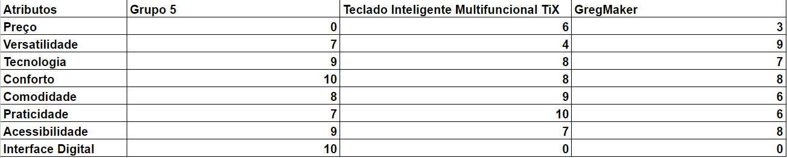

# Entendimento de negócio

## Matriz de Avaliação de Valor Oceano Azul
Esta ferramenta consiste em analisar o mercado em que uma empresa está inserida, quais são as suas principais concorrentes e, a partir de 4 ações (reduzir, eliminar, aumentar e criar), avaliar oportunidades de inovação e de trazer diferencial, o que a faz criar um novo mercado (chamado de oceano azul) e sair do mercado atual, que possui um grande número de concorrentes (chamado de oceano vermelho).
Pesquisando e aprendendo sobre o produto, o grupo criou uma matriz de avaliação de oceano azul para comparar as solução atuais e a proposta nesse projeto. A seguir, você poderá ver uma análise com as seguintes informações: 8 atributos de comparação (Preço, Versatilidade, Tecnologia, Conforto, Comodidade, Praticidade, Acessebilidade e Interface Digital), 3 produtos concorrentes (Grupo 5, Teclado Inteligente Multifuncional TiX e GregMaker) e uma avaliação em escala de 0 a 10. Logo após a apresentação e explicação de cada atributo, você poderá ver um gráfico para compreensão visual da comparação entre os 3 produtos concorrentes e a conclusão que o grupo chegou referente a avaliação feita.
### Matriz Oceano Azul

A seguir, acompanhe a explicação sobre cada atributo; qual a ação que ele recebeu; e o motivo da nota recebida por cada uma das empresas:

### Preço

### Versatilidade

### Tecnologia

### Conforto

### Comodidade

### Praticidade

### Acessibilidade

### Interface Digital

Com base na avaliação e em sua descrição previamente realizada. A seguir, é possível avaliar a comparação e seus atributos de forma visual, através de um gráfico de linhas.

Podemos concluir portanto que...

## Análise Financeira do Projeto

Este documento corresponde ao que é solicitado no card "Entendimento de Negócio" na Sprint 1.

### Receita 

### Orçamento total

### Custos

#### Métodos de pagamento

### Simulação de preço

*Sistema Operacional: Ubuntu*

*Carga de Trabalho: Pico de tráfego semanal*

*Instância: T3 micro*

*Pagamento: Sob demanda* 

