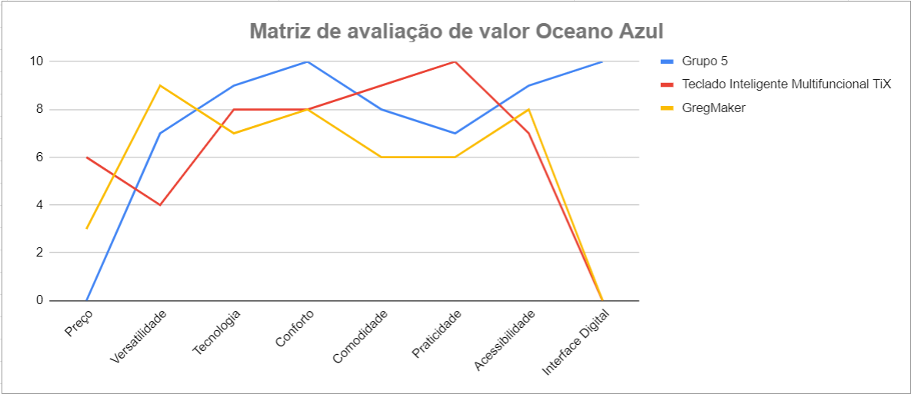

# Entendimento de negócio

## Matriz de Avaliação de Valor Oceano Azul
Esta ferramenta consiste em analisar o mercado em que uma empresa está inserida e quais são seus principais concorrentes usando quatro ações: reduzir, eliminar, aumentar e criar. Usando essas ações, é possível avaliar oportunidades de inovação e criar diferencial, o que leva an uma empresa a criar um novo mercado (chamado de oceano azul) e sair do mercado atual, onde há muitos concorrentes.
Para comparar as soluções atuais e a proposta para o projeto, o grupo criou uma matriz de avaliação Blue Ocean após fazer pesquisas e aprender sobre o produto. Uma análise com as informações a seguir está disponível: oito atributos de comparação: preço, versatilidade, tecnologia, conforto, comodidade, praticidade, acessibilidade e interface digital; três produtos concorrentes: Grupo 5, Teclado Inteligente Multifuncional TiX e GregMaker; e uma classificação de 0 a 10. Após a apresentação e explicação de cada característica, você pode ver um gráfico para obter uma compreensão visual da comparação dos três produtos concorrentes e as conclusões que o grupo chegou com base na avaliação realizada.

### Matriz Oceano Azul

A seguir, acompanhe a explicação sobre cada atributo; qual a ação que ele recebeu; e o motivo da nota recebida por cada uma das empresas:

### Preço

A avaliação do preço baseou-se nos valores encontrados nos sites de cada produto de tecnologia assistiva. As notas atribuídas a este atributo foram as seguintes: O Grupo 5 recebeu nota 10, pois oferece sua tecnologia assistiva gratuitamente à AACD. O Teclado Inteligente Multifuncional TiX recebeu nota 3 devido ao custo de R$4.680 para um tratamento de 24 meses. O GregMaker obteve nota 6, pois tem um custo de R$500 para o mesmo período.

### Versatilidade

A avaliação da versatilidade levou em consideração a capacidade de cada produto ser adaptado para executar tarefas específicas determinadas por um Terapeuta Ocupacional (TO). As notas atribuídas para este atributo foram as seguintes: O Grupo 5 recebeu nota 7, pois oferece programação em blocos de histórias terapêuticas. O Teclado Inteligente Multifuncional TiX recebeu nota 4, pois possui poucas oportunidades de programação, mas ainda é adaptável para uso versátil dentro de um computador. O GregMaker obteve nota 9 devido à sua alta capacidade de programação, permitindo versatilidade tátil quase infinita e sua utilização como base para outros projetos.

### Tecnologia

A avaliação da tecnologia foi baseada nas tecnologias suportadas e utilizadas em cada produto. As notas atribuídas para este atributo foram as seguintes: O Grupo 5 recebeu nota 9, pois utiliza tecnologias integradas e programáticas, além de uma linguagem compiladora intermediária, integração com aplicação web como ferramenta de gestão do produto e o uso de aprendizado de máquina para sugestão de fluxos de atividades terapêuticas. O Teclado Inteligente Multifuncional TiX obteve nota 8, uma vez que oferece tecnologia de fácil utilização com interface plug-and-play e visão computacional. O GregMaker recebeu uma nota menor, uma vez que não apresenta um diferencial tecnológico significativo em relação aos outros produtos, embora seja mais manipulável para aprimoramentos específicos.

### Conforto

A avaliação do conforto considerou o material do produto em contato com o usuário. As notas atribuídas para este atributo foram as seguintes: O Grupo 5 recebeu nota 10 por oferecer um tapete texturizado e sensível ao toque, assemelhando-se a diferentes objetos do cotidiano do paciente. Tanto o Teclado Inteligente Multifuncional TiX quanto o GregMaker utilizam materiais que não são confortáveis ao toque, como o plástico, uma vez que o foco desses produtos não está na sensação tátil, mas sim na funcionalidade.

### Comodidade

A avaliação da comodidade levou em consideração o affordance do produto, ou seja, a forma e os métodos de utilização do produto, levando em consideração as limitações do usuário. As notas atribuídas para este atributo foram as seguintes: O Grupo 5 recebeu nota 8, pois, embora seja intuitivo, requer uma maior amplitude e esforço nos movimentos de toque. O Teclado Inteligente Multifuncional TiX obteve nota 9, sendo um produto objetivo e fácil de usar, exigindo pouco esforço. O GregMaker recebeu nota 7, pois depende de diferentes objetos para ser utilizado, variando sua comodidade dependendo de como foi planejado para ser utilizado.

### Praticidade

A avaliação da praticidade considerou a facilidade de instalação e uso do produto. As notas atribuídas para este atributo foram as seguintes: O Grupo 5 obteve nota 7, uma vez que requer programação prévia e espaço adicional. O Teclado Inteligente Multifuncional TiX recebeu nota 10, pois é fácil de ser usado e pode ser utilizado em diferentes sistemas e ambientes, sendo plug-and-play. O GregMaker obteve nota 6, uma vez que depende de uma configuração e preparação maiores em relação aos outros produtos para alcançar os mesmos níveis de estímulos.

### Acessibilidade

A avaliação da acessibilidade considerou a quantidade de recursos de estímulo oferecidos por cada uma das tecnologias para diferentes públicos dentro do público-alvo. As notas atribuídas para este atributo foram as seguintes: O Grupo 5 obteve nota 9, uma vez que oferece estímulos táteis, visuais e sonoros para a criança. O Teclado Inteligente Multifuncional TiX recebeu nota 7, oferecendo estímulos táteis e visuais. O GregMaker obteve nota 8, com estímulos táteis e visuais, mas com maior variedade de possibilidades em comparação com o TiX.

### Interface Digital

A avaliação da Interface Digital levou em consideração o sistema que suporta o uso do produto. As notas atribuídas para este atributo foram as seguintes: O Grupo 5 obteve nota 10, uma vez que é o único a fornecer uma interface digital programável de gestão para o Terapeuta Ocupacional, além de estímulos visuais para a criança através de um display. Tanto o Teclado Inteligente Multifuncional TiX quanto o GregMaker receberam nota 0, uma vez que não oferecem esse recurso, que é um dos principais diferenciais do produto do Grupo 5.

Com base na avaliação e em sua descrição previamente realizada. A seguir, é possível avaliar a comparação e seus atributos de forma visual, através de um gráfico de linhas.

Em resumo, a escolha entre esses produtos depende das prioridades e necessidades específicas. O Grupo 5 se destaca em termos de tecnologia, interface digital e preço acessível. O Teclado Inteligente Multifuncional TiX oferece praticidade e comodidade, enquanto o GregMaker é altamente versátil e proporciona variedade de estímulos.

## Análise Financeira do Projeto

Este documento corresponde ao que é solicitado no card "Entendimento de Negócio" na Sprint 1.

### Receita 

### Orçamento total

### Custos

#### Métodos de pagamento

### Simulação de preço

*Sistema Operacional: Ubuntu*

*Carga de Trabalho: Pico de tráfego semanal*

*Instância: T3 micro*

*Pagamento: Sob demanda* 

